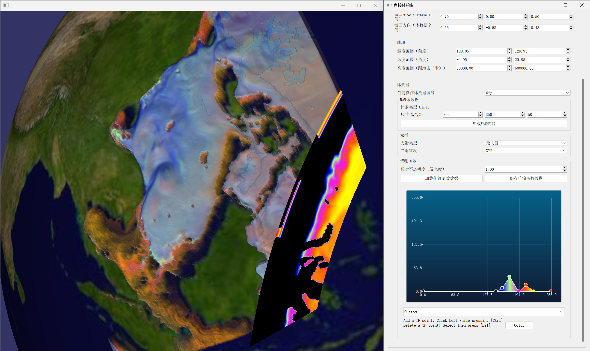

# VIS on Earth for Qt x OSG

## 介绍

项目旨在在Qt x OSG平台上实现面向地球的可视化功能（主要面向科学可视化）。

项目利用Qt的动态反射功能，将Qt的UI控件直接映射到OSG的Uniform（见[reflectable.h](./vis4earth/reflectable.h)和[qt_osg_reflectable.h](./vis4earth/qt_osg_reflectable.h)），去除了中间层，简化了各种业务代码。使用方式举例如下：

- UI控件需命名为 `<控件类型>_<成员名>_<成员类型>_VIS4EarthReflectable`
- 继承 `QtOSGReflectableWidget` 并写代码如下：

```cpp
// dvr.h
class DirectVolumeRenderer : public QtOSGReflectableWidget {
    Q_OBJECT

  public:
    DirectVolumeRenderer(QWidget *parent = nullptr) : QtOSGReflectableWidget(ui, parent) {
        // ...
        for (auto obj : std::array<QtOSGReflectableWidget *, 3>{this, &geoCmpt, &volCmpt})
            obj->ForEachProperty([&](const std::string &name, const Property &prop) {
                    stateSet->addUniform(prop.GetUniform());
        });
    }
  private:
    Ui::DirectVolumeRenderer ui;
    osg::ref_ptr<osg::ShapeDrawable> sphere;
    // ...
};
```

使用对象-组件模式（Object-Component）构建UI。使用方式举例如下：

```cpp
// dvr.h
class DirectVolumeRenderer : public QtOSGReflectableWidget {
    Q_OBJECT

  public:
    DirectVolumeRenderer(QWidget *parent = nullptr) : QtOSGReflectableWidget(ui, parent) {
        layout()->addWidget(&geoCmpt);
        layout()->addWidget(&volCmpt);
        // ...
    }
  private:
    // ...
    GeographicsComponent geoCmpt;
    VolumeComponent volCmpt;
};
```

## 经过测试的依赖

- C++ 11
- Qt 5.12
- OSG 3.6.5

## 功能

- [x] 传输函数调节
- [x] 直接体绘制
- [x] 直接体绘制（截面）
- [x] 直接体绘制（时序数据）
- [x] 直接体绘制（基于传输函数的多体混合绘制）
- [x] 直接体绘制（预积分传输函数）
- [x] 直接体绘制（Blinn-Phong局部光照）
- [x] Marching Cube 等值面绘制
- [x] Marching Square 等值线绘制

## 展示

- 直接体绘制（截面+预积分传输函数+Blinn-Phong）


